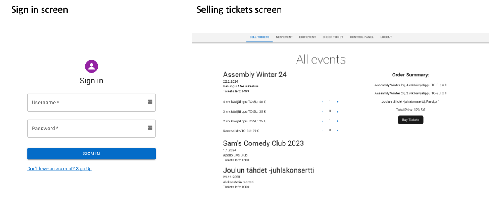
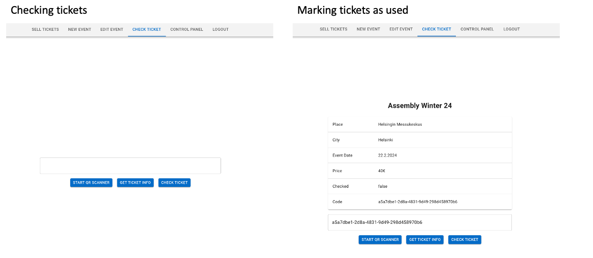
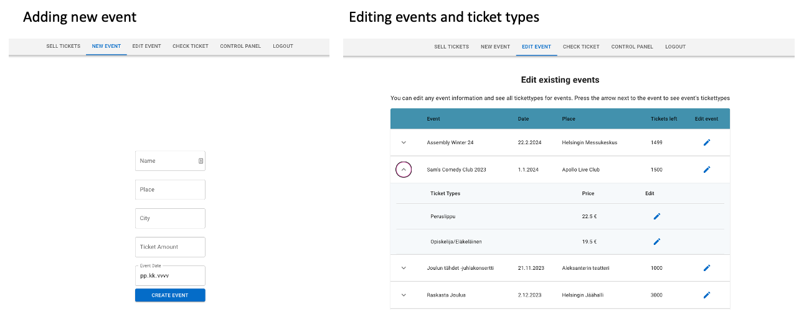
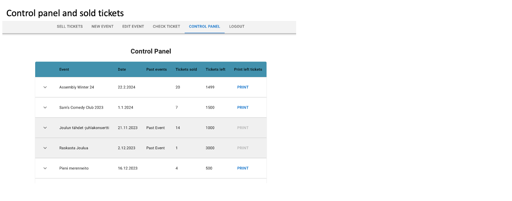
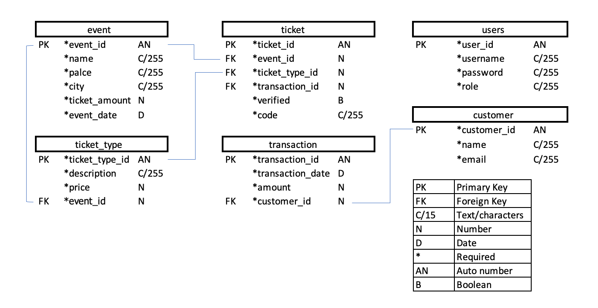

# TicketGuru project

SK(R)UM team: Ulla Montonen, Santeri Sajari and Kristjan Savolainen. Additionally, Maiju Rekola participated in the creation of the project in its initial phase.

## Introduction

This project has been produced as part of the Software Project 1 course at Haaga-Helia University of Applied Sciences.

* The client for the project is the Ticket Office.
* We developed a ticket sales system named TicketGuru.
* The ticket office has the capability to create new events, specify the quantity of tickets available for each event, define ticket types for the event, and set the prices for these ticket types.
* Tickets can be printed after purchase. Additionally, all unsold tickets can be printed for on-site sales at the door.
* The application generates easily verifiable QR codes for the tickets, facilitating authenticity verification with a mobile terminal.

Implementation and Operating Environment Briefly:
* Maven project version 3.1.3
* Java 17

Dependencies
* Spring Boot DevTools
* Spring Web
* MySQL driver
* MariaDB Java Client
* Spring Boot test
* Spring Boot JPA
* H2 database
* Apache commons math3
* Spring Boot Security
* JSON Web Token jwt.io
* Jaxb-api

The application is used on a computer or mobile device, and tickets are scanned with a mobile terminal.

In addition, a client-side has been created for this project, which can be found here: [TicketGuru client](https://github.com/kridesav/TicketGuru_client).

## System Definition
Identified user roles in this project:
* Admin (admin)
* Ticket Seller (user)
* Ticket Inspector (scanner)
* Buyer (will be implemented in the future)

User roles and stories are presented in more detail here: [User Roles and Stories](Documentation/UserRolesAndStories.md)

## User interface

## Database

The database for this project has been built using MariaDB. Below is an image of the database structure, and detailed explanations of the attributes of the database tables accompany it.

### Event
The "event" table contains information about an event. Multiple tickets can be sold for an event, and each ticket is valid only for a specific event.

| Attribute       | Type                    | Description                            |
|:--------------- |:------------------------|:---------------------------------------|
| id PK           | Integer (autoincrement) | Event id, not null                     |
| name            | Varchar(255)            | Name of the event, not null            |
| place           | Varchar(255)            | Place/space of the event, not null     |
| city            | Varchar(255)            | The city of the event, not null        |
| ticketAmount    | Integer                 | Number of tickets to be sold, not null |
| eventDate       | Date                    | Date of the event, not null            |

### Ticket
The "ticket" table contains information about a ticket. A ticket is valid for a specific event. Each ticket can have one ticket type, and a ticket type may be associated with multiple tickets.

| Attribute            | Type                    | Description                                                     |
|:-------------------- |:------------------------|:----------------------------------------------------------------|
| id PK                | Integer (autoincrement) | Ticket id                                                       |
| event_id  FK         | Integer                 | Reference to the Event in the Event table. Not null             |
| ticketType_id FK     | Integer                 | Reference to the ticket type in the TicketType table. Not null  |
| transaction_id FK    | Integer                 | Reference to the sales event in the Transaction table. Not null |
| verified             | Boolean                 | Ticket verification status, not null                            |
| code                 | Varchar(255)            | Unique ticket code, not null                                    |

### TicketType
The "ticket_type" table contains different types of tickets. The same TicketType can be associated with different tickets. Each ticket can have only one TicketType.

| Attribute     | Type                    | Description                                                   |
|:------------- |:------------------------|:--------------------------------------------------------------|
| id PK         | Integer (autoincrement) | Ticket Type id, not null                                      |
| description   | Varchar(255)            | Description of the ticket type (e.g., adult, child). Not null |
| price         | Double                  | Price of the ticket type, not null                            |
| Event_id  FK  | Integer                 | Reference to the Event in the Event table. Not null           |

### User 
The "user" table contains users with roles. A user can have only one active role. Each role always has specific permissions.

| Attribute    | Type                    | Description                    |
|:------------ |:------------------------|:-------------------------------|
| id PK        | Integer (autoincrement) | User id                        |
| username     | Varchar(255)            | Username of the user, not null |
| password     | Varchar(255)            | Password of the user, not null |
| role         | Varchar(255)            | User role, not null            |

### Customer
The "customer" table contains customer information. Customers can purchase tickets using their own information.

| Attribute | Type                    | Description             |
|:--------- |:------------------------|:------------------------|
| id PK     | Integer (autoincrement) | Ticket Type id          |
| name      | Varchar(255)            | Customer name, not null |
| email     | Varchar(255)            | Email address, not null |

### Transaction
The "transaction" table contains information about sales transactions. The table also includes details about the customer who purchased the ticket in that transaction.

| Attribute            | Type                    | Description                               |
|:-------------------- |:------------------------|:------------------------------------------|
| id PK                | Integer (autoincrement) | Transaction id                            |
| transaction_date     | Date                    | Date of the transaction, not null         |
| amount               | Double                  | Amount of the transaction, not null       |
| customer_id FK       | Integer                 | Reference to the Customer table. Not nill |

# Ticket Selling API

This is the documentation for the Ticket Selling API, which allows you to manage customers, events, transactions, ticket types and tickets in a ticket-selling application.

## Endpoints
Here, we have detailed all the endpoints. For each endpoint, there is more detailed documentation that you can read by clicking on the title of the respective endpoint.

### [Customers](RESTDoc/customer.md)

- **GET /api/customers**: Get a list of customers.
- **POST /api/customers**: Create a new customer.
- **PUT /api/customers/{id}**: Update an existing customer.
- **DELETE /api/customers/{id}**: Delete a customer.

### [Events](RESTDoc/event.md)

- **GET /api/events**: Get a list of events.
- **POST /api/events**: Create a new event.
- **PUT /api/events/{id}**: Update an existing event.
- **DELETE /api/events/{id}**: Delete an event.

### [Tickets](RESTDoc/ticket.md)

- **GET /api/tickets**: Get a list of tickets.
- **POST /api/tickets**: Create a new ticket.
- **PUT /api/tickets/{id}**: Update an existing ticket.
- **DELETE /api/tickets/{id}**: Delete a ticket.

### [Transactions](RESTDoc/transaction.md)

- **GET /api/transactions**: Get a list of transactions.
- **POST /api/transactions**: Create a new transaction.
- **PUT /api/transactions/{id}**: Update an existing transaction.
- **DELETE /api/transactions/{id}**: Delete a transaction.

### [Ticket Types](RESTDoc/TicketType.md)

- **GET /api/ticketTypes**: Get a list of ticketTypes.
- **POST /api/ticketTypes**: Create a new ticketType.
- **PUT /api/ticketTypes/{id}**: Update an existing ticketType.
- **DELETE /api/ticketTypes/{id}**: Delete a ticketType.

### [Ticket Check](RESTDoc/TicketCheck.md)

- **GET /api/tickets/check/{ticketcode}**: Checking the ticket.

### [Ticket Markused](RESTDoc/TicketMarkused.md)

- **PATCH /api/tickets/markused/{ticketcode}**: Marking the ticket as used.

### [Generated tickets](RESTDoc/generatetickets.md)

- **POST /api/generatetickets**: Printing the unsold ticket.

## Authentication

Currently all endpoints require a valid Token to be included in the request. The authentication token has been created using JSON Web Token. 

A Token can be acquired from the Login view. More information on login can be found here: [login info](RESTDoc/login.md)

# Technical description

Need some text.

~~POISTA:Teknisessä kuvauksessa esitetään järjestelmän toteutuksen suunnittelussa tehdyt tekniset ratkaisut, esim.

Missä mikäkin järjestelmän komponentti ajetaan (tietokone, palvelinohjelma) ja komponenttien väliset yhteydet (vaikkapa tähän tyyliin: https://security.ufl.edu/it-workers/risk-assessment/creating-an-information-systemdata-flow-diagram/)
Palvelintoteutuksen yleiskuvaus: teknologiat, deployment-ratkaisut yms.
Keskeisten rajapintojen kuvaukset, esimerkit REST-rajapinta. Tarvittaessa voidaan rajapinnan käyttöä täsmentää UML-sekvenssikaavioilla.
Toteutuksen yleisiä ratkaisuja, esim. turvallisuus.
Tämän lisäksi

ohjelmakoodin tulee olla kommentoitua
luokkien, metodien ja muuttujien tulee olla kuvaavasti nimettyjä ja noudattaa johdonmukaisia nimeämiskäytäntöjä
ohjelmiston pitää olla organisoitu komponentteihin niin, että turhalta toistolta vältytään~~

# Testing

Testing has its own separate documentation, which can be found here: [Testing](Documentation/Testing.md)

The testing process has considered unit testing, integration testing, and end-to-end testing. All the tests mentioned in the documentation have passed.

Additionally, on the end-to-end side, [requirements and user stories](Documentation/UserRolesAndStories.md) have also been tested to ensure that the application we built meets the client's requirements.

# Installation information

In order to use this application, you will need a **programming environment** installed, such as Eclipse. You also need to make sure that Java is installed in your computer. You will also need a **production environment** (we used Rahti) and a **database** (we used MariaDB)

## Development environment
First, you need to install a programming environment, if you do not already have one. Then you can clone our project using command: `git clone https://github.com/UllaMontonen/TicketGuru.git`
In a programming environment such as eclipse, you can import an existing Maven project and run it. The project will launch at the url: [http://localhost:8080/](http://localhost:8080/)

## Production environment
After successfully setting up your development environment, the next step is to install the database (see the next section). At this point, it is also crucial to consider the security aspects of your project. Please note that authentication tokens are already integrated into our TicketGuru project.

Next, you'll need to choose a production environment and familiarize yourself with its documentation. Typically, deploying your project involves configuring it on a production server, ensuring that the database is properly set up. Keep in mind that each time you make changes to your code, manual deployment to the production server is required unless an automated system is in place.

## Database
You can choose the database you want to use in the `application.properties` file. In this project, you'll find an `application-dev.properties` file that utilizes the H2 database, while the `application-rahti.properties` file uses the MariaDB database. In the `application.properties` file, you can specify which one is active and in use.

The [TicketGuruDBSchem](https://github.com/UllaMontonen/TicketGuru/blob/main/src/main/resources/TicketGuruDBSchema.sql) is employed to create the database. You can customize this file, for instance, to add more users with different permission roles. Bcrypt is employed as a password-hashing function in the database.

~~POISTA: Asennusohjeesta tulisi ainakin käydä ilmi, miten käytettävä tietokanta ja käyttäjät tulee ohjelmistoa asentaessa määritellä (käytettävä tietokanta, käyttäjätunnus, salasana, tietokannan luonti yms.).~~

# Startup and user instructions

The application can be launched from the following URL: [https://ticketguru-ticketmaster.rahtiapp.fi/](https://ticketguru-ticketmaster.rahtiapp.fi/)

In this documentation, you will find information on how the application works and how the REST API functions.

Test credentials have been used in the application to create different user profiles.
Users have been assigned different roles, and functionalities have been restricted accordingly.

Login credentials:
| Username | Password | Role                                                            |
|:-------- |:---------|:----------------------------------------------------------------|
| admin    | admin    | admin: all rights                                               |
| user     | user     | user: selling tickets and checking tickets/marking them as used |
| scanner  | scanner  | scanner: checking tickets/marking them as used                  |

