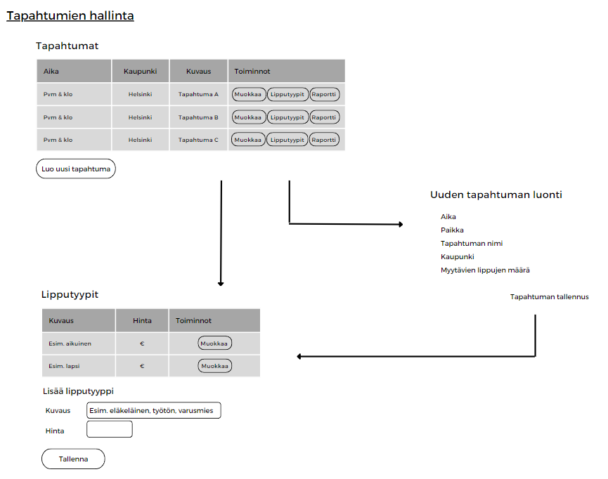
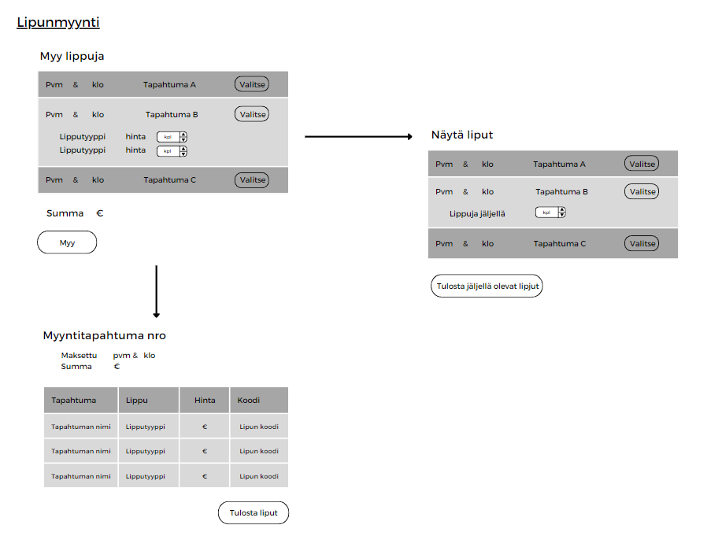
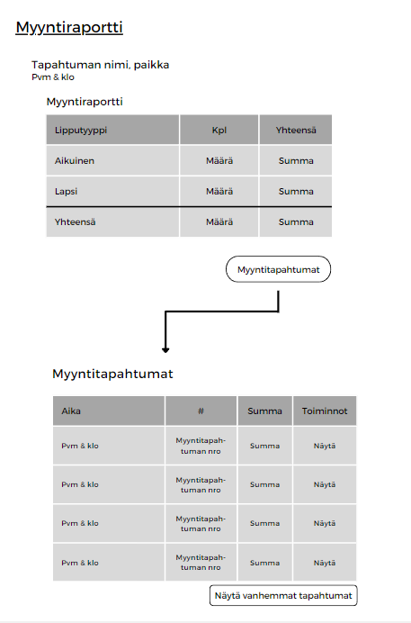
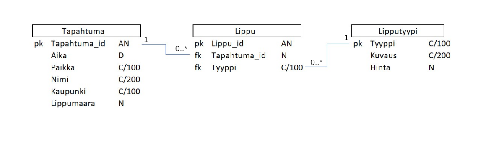

# TicketGuru projekti

SK(R)UM tiimi: Ulla Montonen, Santeri Sajari, Maiju Rekola, Kristjan Savolainen

## Johdanto

* Asiakkaana Tickettoimisto.
* Lipunmyyntijärjestelmä nimeltä TicketGuru. 
* Tickettoimisto syöttää myytävät liput, Tapahtuman kuvauksen ja hinnat ja asiakas pystyy ostamaan ne.
* Asiakas pystyy tulostamaan ostamansa liput.
* Sovellus tuottaa lipuille helposti tarkastettavan koodin, millä pystyy todentamaan lipun aitouden mobiilipäätteellä.

Toteutus- ja toimintaympäristö lyhyesti:
* Maven projekti 3.1.3
* Java 17

Riippuvuudet/dependencies
* Spring Boot DevTools
* Spring Web
* MySQL driver

Käytetään tietokoneella ja liput luetaan mobiilipäätteellä.

## Järjestelmän määrittely
Tässä projektissa tunnistettuja käyttäjärooleja:
* Admin
* Lipunmyyjä
* Lipuntarkastaja
* Ostaja

Lisää: [Käyttäjäryhmät ja tarinat](https://github.com/UllaMontonen/TicketGuru/blob/dev/KayttajaroolitJaTarinat.md)

## Käyttöliittymä

## Tietokanta

 ### Event
Event-taulu sisältää tapahtuman tiedot. Tapahtumaan voidaan myydä monta lippua. Lippu käy vain tiettyyn tapahtumaan. 

| Attribuutti | Tyyppi | Kuvaus |
| --- |:---:| ---:|
| id PK           | Integer (autoincrement) | Tapahtuman id |
| eventDate        | Date | Tapahtuman ajankohta |
| place           | Varchar(100) | Tapahtuman paikka/tila |
| name            | Varchar(200) | Tapahtuman nimi |
| city            | Varchar(100) | Tapahtuman järjestyskaupunki |
| ticketAmount    | Integer | Myytävien Ticketjen määrä |

### Ticket
Ticket-taulu sisältää lipun tiedot. Ticket käy tiettyyn tapahtumaan. Yhdellä lipulla voi olla yksi Ticket tyyppi. Ticket tyyppi voi olla useammalla lipulla.

| Attribuutti | Tyyppi | Kuvaus |
| --- |:---:| ---:|
| id PK      | Integer (autoincrement) | Lipun id |
| Event_id  FK | Integer | Viittaus Tapahtumaan Event-taulussa |
| Tyyppi_id FK     | Varchar(100) | Viittaus lipun tyyppiin TicketType-taulussa |
| transaction_id FK     | Varchar(100) | Viittaus myynti tapahtumaan Transaction-taulussa |
| code     | Varchar(100) | Lipun koodi |
| transaction_id FK     | Varchar(100) | Viittaus myynti tapahtumaan Transaction-taulussa |
| verified     | boolean | Maksutapahtuman tila |

### TicketType
TicketType-taulu sisältää Ticketjen eri tyypit. Sama TicketType voi olla eri lipuilla. Yhdellä lipulla voi olla vain yksi TicketType.

| Attribuutti | Tyyppi | Kuvaus |
| --- |:---:| ---:|
| id PK     | C/100 | Ticket tyypin id |
| description          | Varchar(200) | Ticket tyypin kuvaus (esim. aikuinen, lapsi) |
| price           | Integer | Ticket tyypin hinta |
| Event_id  FK | Integer | Viittaus Tapahtumaan Event-taulussa |

### Customer
Customer-taulu sisältää asiakkaan tiedot. Asiakkaat voivat omilla tiedoilla ostaa lippuja. 

| Attribuutti | Tyyppi | Kuvaus |
| --- |:---:| ---:|
| id PK     | C/100 | Ticket tyypin id |
| name           | Varchar(200) | Asiakkaan nimi |
| email           | Varchar(200) | Sähköposti osoite |

### Transaction
Transaction-taulu sisältää myyntitapahtuman tiedot. Taulu sisältää myös sen asiakkaan jonka lipun osti tiedot.

| Attribuutti | Tyyppi | Kuvaus |
| --- |:---:| ---:|
| id PK     | C/100 | Ticket tyypin id |
| name FK          | Varchar(200) | Asiakkaan nimi |
| amount           | Integer | määrä |
| date          | Date | Myyntitapahtuman aikaleima |

## Ticket Selling API

This is the documentation for the Ticket Selling API, which allows you to manage customers, events, and tickets in a ticket-selling application.

## Endpoints

### Customers

- **GET /api/customers**: Get a list of customers.
- **POST /api/customers**: Create a new customer.
- **PUT /api/customers/{id}**: Update an existing customer.
- **DELETE /api/customers/{id}**: Delete a customer.

### Events

- **GET /api/events**: Get a list of events.
- **POST /api/events**: Create a new event.
- **PUT /api/events/{id}**: Update an existing event.
- **DELETE /api/events/{id}**: Delete an event.

### Tickets

- **GET /api/tickets**: Get a list of tickets.
- **POST /api/tickets**: Create a new ticket.
- **PUT /api/tickets/{id}**: Update an existing ticket.
- **DELETE /api/tickets/{id}**: Delete a ticket.