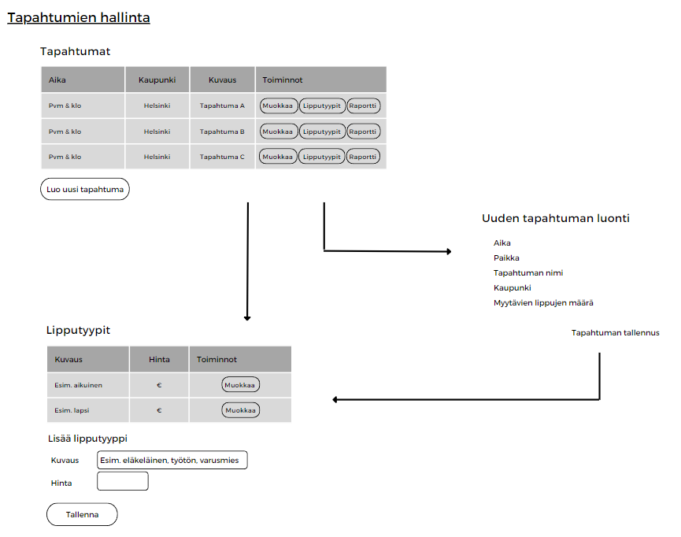
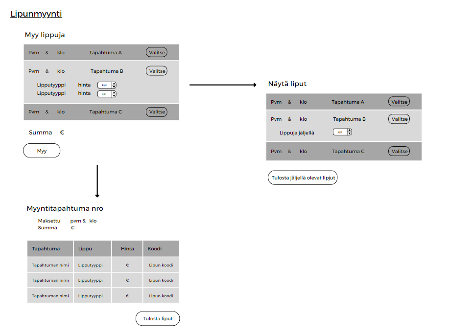
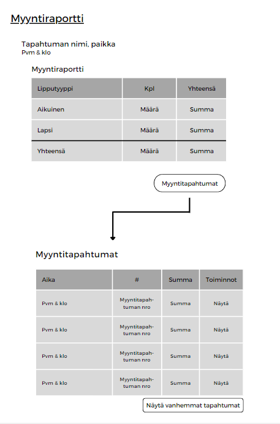

# TicketGuru project

SK(R)UM team: Ulla Montonen, Santeri Sajari and Kristjan Savolainen. Additionally, Maiju Rekola participated in the creation of the project in its initial phase.

## Introduction

This project has been produced as part of the Software Project 1 course at Haaga-Helia University of Applied Sciences.

* The client for the project is the Ticket Office.
* We developed a ticket sales system named TicketGuru.
* The ticket office has the capability to create new events, specify the quantity of tickets available for each event, define ticket types for the event, and set the prices for these ticket types.
* Tickets can be printed after purchase. Additionally, all unsold tickets can be printed for on-site sales at the door.
* The application generates easily verifiable QR codes for the tickets, facilitating authenticity verification with a mobile terminal.

Implementation and Operating Environment Briefly:
* Maven project version 3.1.3
* Java 17

Dependencies
* Spring Boot DevTools
* Spring Web
* MySQL driver

The application is used on a computer or mobile device, and tickets are scanned with a mobile terminal.

In addition, a client-side has been created for the project, which is available as a published GitHub Pages: [TicketGuru client](https://kridesav.github.io/TicketGuru_client/).

## System Definition
Identified user roles in this project:
* Admin (admin)
* Ticket Seller (user)
* Ticket Inspector (scanner)
* Buyer (will be implemented in the future)

User roles and stories are presented in more detail here: [User Roles and Stories](Documentation/UserRolesAndStories.md)

## User interface (will be updated!!!)

## Database

The database for this project has been built using MariaDB. Below is an image of the database structure, and detailed explanations of the attributes of the database tables accompany it."

### Event
The "event" table contains information about an event. Multiple tickets can be sold for an event, and each ticket is valid only for a specific event.

| Attribute | Type | Description |
| --- |:---:| ---:|
| id PK           | Integer (autoincrement) | Event id, not null |
| name            | Varchar(255) | Name of the event, not null |
| place           | Varchar(255) | Place/space of the event, not null |
| city            | Varchar(255) | The city of the event, not null |
| ticketAmount    | Integer | Number of tickets to be sold, not null |
| eventDate        | Date | Date of the event, not null |

### Ticket
The "ticket" table contains information about a ticket. A ticket is valid for a specific event. Each ticket can have one ticket type, and a ticket type may be associated with multiple tickets.

| Attribute | Type | Description |
| --- |:---:| ---:|
| id PK      | Integer (autoincrement) | Ticket id |
| event_id  FK | Integer | Reference to the Event in the Event table. Not null |
| ticketType_id FK     | Integer | Reference to the ticket type in the TicketType table. Not null |
| transaction_id FK     | Integer | Reference to the sales event in the Transaction table. Not null |
| verified     | Boolean | Ticket verification status, not null |
| code     | Varchar(255) | Unique ticket code, not null |

### TicketType
The "ticket_type" table contains different types of tickets. The same TicketType can be associated with different tickets. Each ticket can have only one TicketType.

| Attribute | Type | Description |
| --- |:---:| ---:|
| id PK     | Integer (autoincrement) | Ticket Type id, not null |
| description          | Varchar(255) | Description of the ticket type (e.g., adult, child). Not null |
| price           | Double | Price of the ticket type, not null |
| Event_id  FK | Integer | Reference to the Event in the Event table. Not null |

### User 
The "user" table contains users with roles. A user can have only one active role. Each role always has specific permissions.

| Attribute | Type | Description |
| --- |:---:| ---:|
| id PK     | Integer (autoincrement) | User id |
| username           | Varchar(255) | username of the user, not null |
| password           | Varchar(255) | password of the user, not null |
| role           | Varchar(255) | User role, not null |

### Customer
The "customer" table contains customer information. Customers can purchase tickets using their own information.

| Attribute | Type | Description |
| --- |:---:| ---:|
| id PK     | Integer (autoincrement) | Ticket Type id |
| name           | Varchar(255) | Customer name, not null |
| email           | Varchar(255) | email address, not null |

### Transaction
The "transaction" table contains information about sales transactions. The table also includes details about the customer who purchased the ticket in that transaction.

| Attribute | Type | Description |
| --- |:---:| ---:|
| id PK     | Integer (autoincrement) | Transaction id |
| transaction_date     | Date | Date of the transaction, not null |
| amount           | Double | amount of the transaction, not null |
| customer_id FK          | Integer | Reference to the Customer table. Not nill |

# Ticket Selling API

This is the documentation for the Ticket Selling API, which allows you to manage customers, events, transactions, ticket types and tickets in a ticket-selling application.

## Endpoints
Here, we have detailed all the endpoints. For each endpoint, there is more detailed documentation that you can read by clicking on the title of the respective endpoint.

### [Customers](RESTDoc/customer.md)

- **GET /api/customers**: Get a list of customers.
- **POST /api/customers**: Create a new customer.
- **PUT /api/customers/{id}**: Update an existing customer.
- **DELETE /api/customers/{id}**: Delete a customer.

### [Events](RESTDoc/event.md)

- **GET /api/events**: Get a list of events.
- **POST /api/events**: Create a new event.
- **PUT /api/events/{id}**: Update an existing event.
- **DELETE /api/events/{id}**: Delete an event.

### [Tickets](RESTDoc/ticket.md)

- **GET /api/tickets**: Get a list of tickets.
- **POST /api/tickets**: Create a new ticket.
- **PUT /api/tickets/{id}**: Update an existing ticket.
- **DELETE /api/tickets/{id}**: Delete a ticket.

### [Transactions](RESTDoc/transaction.md)

- **GET /api/transactions**: Get a list of transactions.
- **POST /api/transactions**: Create a new transaction.
- **PUT /api/transactions/{id}**: Update an existing transaction.
- **DELETE /api/transactions/{id}**: Delete a transaction.

### [Ticket Types](RESTDoc/TicketType.md)

- **GET /api/ticketTypes**: Get a list of ticketTypes.
- **POST /api/ticketTypes**: Create a new ticketType.
- **PUT /api/ticketTypes/{id}**: Update an existing ticketType.
- **DELETE /api/ticketTypes/{id}**: Delete a ticketType.

### [Ticket Sales](RESTDoc/TicketSale.md)

- **POST /api/event/{eventId}/ticketTypes/{ticketTypeId}**: Create a new ticket sale.

### [Ticket Check](RESTDoc/TicketCheck.md)

- **GET /api/tickets/check/{ticketcode}**: Checking the ticket.

### [Ticket Markused](RESTDoc/TicketMarkused.md)

- **PATCH /api/tickets/markused/{ticketcode}**: Marking the ticket as used.

## Authentication

Currently all endpoints require a valid Token to be included in the request. A Token can be acquired from the Login view. More information on login can be found here: [login info](RESTDoc/login.md)

# Technical description

Need some text.

# Testing

Testing has its own separate documentation, which can be found here: [Testing](Documentation/Testing.md)

The testing process has considered unit testing, integration testing, and end-to-end testing. All the tests mentioned in the documentation have passed.

Additionally, on the end-to-end side, [requirements and user stories](Documentation/UserRolesAndStories.md) have also been tested to ensure that the application we built meets the client's requirements.

# Installation information

Need some text.

# Startup and user instructions

need some text.
